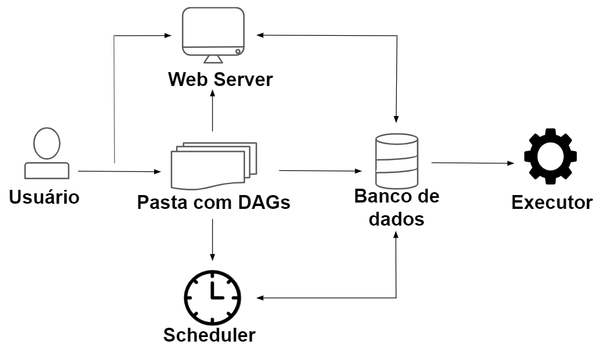

Extração de Dados do Twitter

Busca os dados no Twitter informando o assunto, data de início e fim.<br>


> [!IMPORTANT]  
> Os dados do código não são coletados diretamente do Twitter.


# Criando Ambiente Virtual

Comando que permite ativar o repositório Ubuntu a ter várias versões do Python:
```
sudo add-apt-repository ppa:deadsnakes/ppa
```

Instalando Python:
```
sudo apt install python3.9
```

Pacotes do ambiente virtual:
```
sudo apt install python3.9-venv
```

Dentro da pasta de trabalho crie o ambiente virtual:
```
python3.9 -m venv twitter
```

Ativando o ambiente:
```
source twitter/bin/activate 
```

Instalando o Airflow:
```
pip install "apache-airflow[celery]==2.8.1" --constraint "https://raw.githubusercontent.com/apache/airflow/constraints-2.8.1/constraints-3.8.txt"
```

Exportando variável de ambiente Airflow Home:
```
export AIRFLOW_HOME=/home/rafael/MEGA/github/eng_dados/airflow-twitter/airflow_pipeline/
    ou
export AIRFLOW_HOME=$(pwd)/airflow_pipeline/
```
Iniciando o serviço:
```
airflow standalone
```

Finalizando o serviço:

Crtl + c
```
deactivate
```


## Definindo a versão 
Instalando o Airflow:
```
AIRFLOW_VERSION=2.8.1
PYTHON_VERSION=3.9
CONSTRAINT_URL="https://raw.githubusercontent.com/apache/airflow/constraints-${AIRFLOW_VERSION}/constraints-${PYTHON_VERSION}.txt"
```

# Hook
Configurando a conexão do Airflow com o Twitter



# Operador

O operarador determina o que será executado em uma tarefa.<br>
* Atomicidade - Operador realiza apenas uma tarefa
* Indepotência - Operador sempre obtém os mesmos resultados se receber os mesmo parâmetros
* Isolamento - O código roda de maneira individual, sem outros módulos ou operadores


# Executando

Para testar o código 
twitter_operator.py


# Configurações
No arquivo `airflow.cfg` possui os parâmetros de configuração, trocar:
* load_examples = False | Não exibe os exemplos.