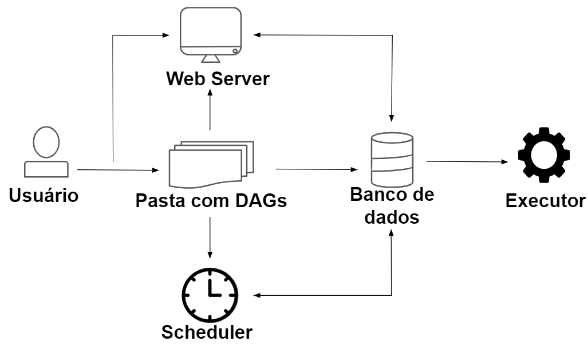

<a id="topo"></a>

<h1 align="center">
  
  <br>
  Extração de Dados do Twitter 
</h1>

<div align="center">

<!-- []() -->
[]()

</div>


Extração de Dados do Twitter utilizando o Airflow para agendar a tarefa. Os dados são coletados informando o assunto, data de início e fim.<br>

Neste exemplo extrai os dados do Twitter utilizando o Airflow, a terefa é programada para ser executa uma vez ao dia. Após a coleta os são armazenado como bronze, a próxima tarefa coleta os dados são limpos e armazenado como prata, em seguida, os são sumarizados para que seja consumido para um dashboard.


> [!IMPORTANT]  
> Os dados do código não são coletados diretamente do Twitter.


[Configurando o ambiente](#1)<br>
[Hook](#2)<br>
[Operador](#3)<br>
[DAG](#4)<br>
[Configurações](#5)<br>
[Arquitetura de Medalhão](#6)<br>
[Spark](#7)<br>


<a id="1"></a>

# Configurando o ambiente

<div align="right">
    <a href="#topo">Voltar ao topo</a>
</div>

* Criando ambiente virtual
    ```
    python3.9 -m venv venv 
    ```

* Ativando o ambiente virtual<br>
    ```
    source venv/bin/activate
    ```

* Definindo a versão
  ```
  AIRFLOW_VERSION=2.9.1

  PYTHON_VERSION=3.9

  CONSTRAINT_URL="https://raw.githubusercontent.com/apache/airflow/constraints-${AIRFLOW_VERSION}/constraints-${PYTHON_VERSION}.txt"

  pip install "apache-airflow[postgres,celery,redis]==${AIRFLOW_VERSION}" --constraint "${CONSTRAINT_URL}"

  airflow db upgrade
  ```

* Exportando a variável de ambiente e criando uma pasta para colocar todos os arquivos do Airflow
  ```
  export AIRFLOW_HOME=$(pwd)/airflow_pipeline
  ```
  > [!WARNING]  
  > O código completo utilza o [Spark](#7)

  * Exportando Spark
  ```
  export SPARK_HOME=/home/rafael/MEGA/github/eng_dados/airflow/twitter/spark-3.1.3-bin-hadoop3.2
  ```

* Iniciando o Airflow
  ```
  airflow standalone
  ```

* Acessando
  http://localhost:8080

* Finalizar
  ```
  ctrl + c
  . deactivate
  ```

<a id="2"></a>

# Hook

<div align="right">
    <a href="#topo">Voltar ao topo</a>
</div>

Gerencia as conexões, ficando responsavel por todas as conexões.<br>
Testando:
  ```
  export AIRFLOW_HOME=$(pwd)/airflow_pipeline
  python3.9 airflow_pipeline/hook/twitter_hook.py  
  ```
Configurando a conexão do Airflow com o Twitter

<h1 align="center">
  
  <br>
</h1>

<a id="3"></a>

# Operador

<div align="right">
    <a href="#topo">Voltar ao topo</a>
</div>

Executa as tarefas.<br>
  * Atomidicade - O operador realiza apenas uma tarefa<br>
  * Idempotência - O operador semrpe obtém os mesmo resultados se receber os mesmo parâmetros<br>
  * Isolamento - O código roda de maneira individual, sem outros módulos ou operadores<br>
Faz a extração dos dados e salva na pasta datalake, uma pasta para cada dia da execução.

<a id="4"></a>

# DAG

<div align="right">
    <a href="#topo">Voltar ao topo</a>
</div>

Orquestra quando vai ser executada cada tarefa.

<a id="5"></a>

# Configurações

<div align="right">
    <a href="#topo">Voltar ao topo</a>
</div>

Ajuste nas configurações no arquivo `airflow.cfg`:
* load_examples = False | Não exibe os exemplos.

<a id="6"></a>

# Arquitetura de Medalhão
<div align="right">
    <a href="#topo">Voltar ao topo</a>
</div>

Separa os dados em camadas.<br>
 * Dados Bronze: Dados brutos<br>
 * Dados Prata: Dados limpos<br>
 * Dados Ouro: Dados processados para alimentar um dashboard<br>


<a id="7"></a>

# Spark

<div align="right">
    <a href="#topo">Voltar ao topo</a>
</div>

Utilizado para analisar os dados, exploração e transformação.

  * Instalando o Hadoop<br>


  ```
  wget https://archive.apache.org/dist/spark/spark-3.1.3/spark-3.1.3-bin-hadoop3.2.tgz

  tar -xvzf spark-3.1.3-bin-hadoop3.2.tgz

  cd spark-3.1.3-bin-hadoop3.2

  ```

  * Executa o processo de leitura e transformação dos dados e salva os arquivos processado.<br>
    * src: Caminho da origem dos dados<br>
    * dest: Caminho onde vai ser salvo os arquivos<br>
    * process_data: Caminho dos dados processados<br>
  ```
  ./bin/spark-submit /home/rafael/MEGA/github/eng_dados/airflow/twitter/src/spark/transformation.py --src /home/rafael/MEGA/github/eng_dados/airflow/twitter/datalake/twitter_datascience --dest /home/rafael/MEGA/github/eng_dados/airflow/twitter/src/spark --process-date 2024-05-11
  ```
  * Instalando o Spark no Airflow
  ```
  pip install apache-airflow-providers-apache-spark
  ```

  * Exportando Spark
  ```
  export SPARK_HOME=/home/rafael/MEGA/github/eng_dados/spark-3.1.3-bin-hadoop3.2
  ```

  > [!TIP]<br>
  > Depois que iniciar o Airflow precisa configurar a conexão do Spark no menu superior `Admin -> Connections -> spark_default`.
  > Trocar Host para local